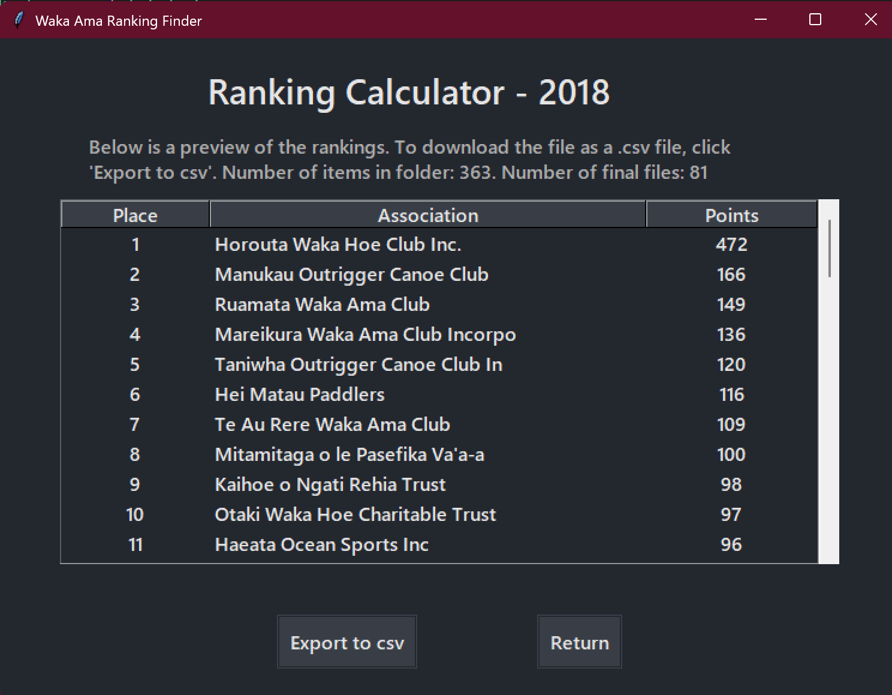

# Waka Ama Ranking Finder

A desktop application for calculating and displaying Waka Ama competition rankings by association.

---

## Features

- **Dark Mode:** Modern, eye-friendly color palette throughout the app.
- **Leaderboard Table:** Results are displayed in a scrollable, sortable table with columns for Place, Association, and Points.
- **Custom Points Scheme:** Easily edit the points awarded for each placing.
- **CSV Export:** Export the leaderboard to a CSV file for sharing or further analysis.
- **Help/Information Screen:** Built-in instructions and rules for using the program.
- **Robust Error Handling:** Clear feedback for invalid input and file issues.
- **Local Data Processing:** All data is processed locally for privacy.

---

## How to Use

1. **Download or clone** this repository.
2. Make sure you have Python 3 and the required libraries (`tkinter`, `Pillow`) installed.
3. Place your year folder (e.g., `WakaNats2019`) somewhere on your computer. Ensure your `.lif` files for finals contain "Final" in their filename.
4. Run the program:
    ```bash
    python S5WakaAma.py
    ```
5. **Select the year** and **choose the folder** containing your results.
6. (Optional) Click **Set Points** to customize the points scheme.
7. Click **Find** to generate the leaderboard.
8. View the results in the table, and (optional) **export to CSV**.
9. Use the **Help/Information** button for guidance.

---

## Folder and File Requirements

- Year folders must be named in the format: `WakaNats{year}` (e.g., `WakaNats2019`).
- Final results files must be in `.lif` format and contain "Final" in the filename.
- Do not store folders inside the year folder; keep it unzipped.

---

## Screenshots



---

## Credits

- Cover image by [PublicDomainPictures on Pixabay](https://pixabay.com/).

---

